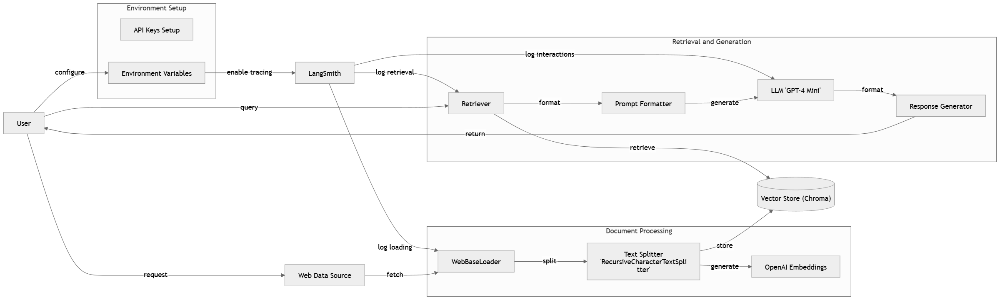

# Retrieval Augmented Generation (RAG)

This guide demonstrates how to build a simple question-answering (Q&A) application that can respond to queries based on specific source information using the **Retrieval Augmented Generation (RAG)** technique. This app utilizes large language models (LLMs) for reasoning and a retrieval component to incorporate data not included in the model's original training. 

## Overview

RAG combines:
1. **Indexing** - Processes and stores the source data in chunks, creating an index.
2. **Retrieval and Generation** - Retrieves relevant chunks in response to a query and generates an answer using LLMs.

## Requirements

- **Jupyter Notebook** - For interactive development and learning.
- **LangChain Libraries** - Includes document loaders, vector stores, and RAG chains.

### Prerequsites
You need to install the following tools and configure their dependencies:

Java (versions 3.12.3)
```bash
python --version
```

Should return something like:
```bash
Python 3.12.3
```

### Installation

Install the necessary dependencies:

```bash
pip install --quiet --upgrade langchain langchain-community langchain-chroma langchain-openai
```

## Running the RAG Q&A Application

This guide walks you through creating a Retrieval Augmented Generation (RAG) app for question-answering. The app uses LangChain, a vector database, and GPT-4 Mini to find answers from a specific text source.


### Step 1: Set Up LangSmith for Tracing

```python
import getpass
import os

os.environ["LANGCHAIN_TRACING_V2"] = "true"
os.environ["LANGCHAIN_API_KEY"] = "your_api_key"
```

We start by setting up LangSmith environment variables. This enables tracking within LangSmith so we can analyze how our workflow performs.

### Step 2: Set Up OpenAI API and Model

```python
os.environ["OPENAI_API_KEY"] = "your_openai_key"
from langchain_openai import ChatOpenAI

llm = ChatOpenAI(model="gpt-4o-mini")
```

Here, we configure the OpenAI API key and choose the GPT-4 Mini model for answering questions.

### Step 3: Load and Split Web Content

```python
import bs4
from langchain_community.document_loaders import WebBaseLoader
from langchain_text_splitters import RecursiveCharacterTextSplitter

loader = WebBaseLoader(
    web_paths=("https://lilianweng.github.io/posts/2023-06-23-agent/",),
    bs_kwargs=dict(
        parse_only=bs4.SoupStrainer(class_=("post-content", "post-title", "post-header"))
    ),
)
docs = loader.load()

text_splitter = RecursiveCharacterTextSplitter(chunk_size=1000, chunk_overlap=200)
splits = text_splitter.split_documents(docs)
```

This step retrieves content from a specified URL, focusing on relevant parts like the title, headers, and main text. The content is then divided into smaller chunks for easier retrieval.

### Step 4: Create a Vector Database

```python
from langchain_chroma import Chroma
from langchain_openai import OpenAIEmbeddings

vectorstore = Chroma.from_documents(documents=splits, embedding=OpenAIEmbeddings())
```

We embed these text chunks into a vector database, which allows us to quickly search for related content using similarity matching.

### Step 5: Set Up the Retriever and Generate Responses

```python
retriever = vectorstore.as_retriever(search_type="similarity", search_kwargs={"k": 6})
retrieved_docs = retriever.invoke("What are the approaches to Task Decomposition?")
```

The retriever searches for relevant content in the vector database. Here, we use it to retrieve answers to a sample question about “Task Decomposition.”

### Step 6: Clean Up the Vector Database

```python
vectorstore.delete_collection()
```

To free up space, we clear the vector database by deleting any stored content after we’re done.

### Step 7: Extract Specific Sections from the Web

```python
bs4_strainer = bs4.SoupStrainer(class_=("post-title", "post-header", "post-content"))
loader = WebBaseLoader(
    web_paths=("https://lilianweng.github.io/posts/2023-06-23-agent/",),
    bs_kwargs={"parse_only": bs4_strainer},
)
docs = loader.load()
```

We specify HTML elements we want to keep, such as the title and main content, then load them from the URL to focus only on relevant sections.

### Step 8: Preview the Loaded Content

```python
print(docs[0].page_content[:500])
```

Here, we print the first 500 characters of the content to check that everything is loading correctly.

### Step 9: Split Text with Start Indexes

```python
text_splitter = RecursiveCharacterTextSplitter(
    chunk_size=1000, chunk_overlap=200, add_start_index=True
)
all_splits = text_splitter.split_documents(docs)
```

This time, we split the content while keeping track of the starting position of each chunk. This helps us reference back to the original text.

### Step 10: Query the Retrieved Documents

```python
retriever = vectorstore.as_retriever(search_type="similarity", search_kwargs={"k": 6})
retrieved_docs = retriever.invoke("What are the approaches to Task Decomposition?")
print(retrieved_docs[0].page_content)
```

We query the retriever to fetch relevant documents, then print the first result to verify the output.

### Step 11: Create a Custom RAG Chain

```python
from langchain_core.output_parsers import StrOutputParser
from langchain_core.runnables import RunnablePassthrough

def format_docs(docs):
    return "\n\n".join(doc.page_content for doc in docs)

rag_chain = (
    {"context": retriever | format_docs, "question": RunnablePassthrough()}
    | llm
    | StrOutputParser()
)

for chunk in rag_chain.stream("What is Task Decomposition?"):
    print(chunk, end="", flush=True)
```

Finally, we define a custom RAG chain that uses the retrieved documents as context and generates a response to the question in real-time through the GPT-4 Mini model.

## Architecural Design




### Explanation of Components:

- User: Initiates the workflow by configuring environment variables, querying data, and receiving the response.

- Environment Setup: Configures API keys and environment variables needed for LangSmith tracing and OpenAI access.

- Web Data Source: Represents the external web data source that contains the information.

- Document Processing: Loads, splits, and embeds the document content.

- Vector Store (Chroma): Stores document embeddings to enable fast similarity-based retrieval.

- Retrieval and Generation: Combines the retriever, language model, and formatter to generate an answer based on relevant context.

- LangSmith: Monitors and traces each step of the workflow, especially retrieval and model interactions.

## Conclusion

This RAG application demonstrates a scalable approach to build LLM-powered Q&A applications. With RAG, you can extend model capabilities by supplementing with custom data, enabling models to answer questions beyond their training.

## Built With

- **[Git](https://git-scm.com/)** - Version Control System
- **[LangChain](https://www.langchain.com/)** - Framework for creating applications with large language models
- **[Jupyter Notebook](https://jupyter.org/)** - Interactive development environment
- **[OpenAI API](https://platform.openai.com/docs/api-reference)** - API for accessing OpenAI's language models

## Authors

- **Hann Jang**

## License

This project is licensed under the MIT License - see the [LICENSE.txt](LICENSE.md) file for details.
